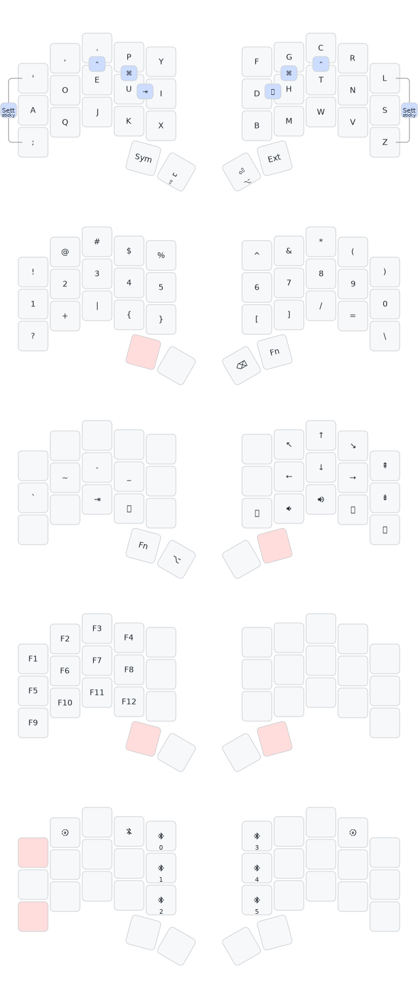

Firmware for: [Urchin Keyboard](https://github.com/duckyb/urchin)

## Getting started

**Are you trying to make your own ZMK firmware?**  
[Here are the steps you need to take.](./GETTING_STARTED.md)

**Do you want to download my keymap?**  

<!-- > [!IMPORTANT] -->
<!-- > My firmware only matches the following diagram if the operating system is set to "Dvorak" keyboard input. -->

[Download the firmware zip from the latest action run.](https://github.com/xayon40-12/urchin-zmk-firmware/actions/workflows/build.yml?query=is%3Asuccess) Check [the ZMK docs](https://zmk.dev/docs/user-setup#installing-the-firmware) for instructions on how to flash it.
https://github.com/xayon40-12/urchin-zmk-firmware/actions/runs/23378528017/artifacts/6039044539

## Keymap Cheat Sheet (uses [keymap-drawer](https://github.com/caksoylar/keymap-drawer))

